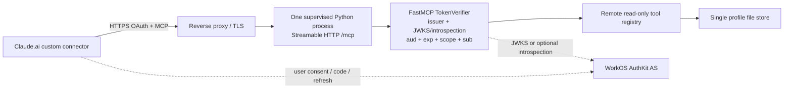

# Claude MCP OAuth on one VPS

> Historical decision report for TASK-203, reviewed 2026-07-20. It captures
> options considered before the current Clerk/Profile implementation; its
> “current” and recommended-runtime statements are not operating instructions.
> Use `README.md` for current operation and
> [`ADR-0004`](../../adr/0004-postgresql-durable-runtime-authority.md) for the
> accepted PostgreSQL architecture. Placeholders such as `mcp.example.com` and
> `<authkit-domain>` are deliberate; this file contains no secrets or personal
> identifiers.

## Decision in one page

### Recommendation — WorkOS AuthKit as external authorization server (CIMD-first, DCR fallback)

**[INFERENCE]** Use a hosted WorkOS AuthKit tenant as the OAuth authorization server and keep Garmin Coach as an OAuth resource server only. Configure one exact MCP resource URL, enable AuthKit's MCP Client ID Metadata Document (CIMD) support and Dynamic Client Registration (DCR) fallback, and verify WorkOS JWT access tokens in FastMCP with a small `TokenVerifier`. The VPS then runs only the existing Python resource server, reverse proxy/TLS, and file-backed profile; it does not contain an authorization UI, `/authorize`, `/token`, `/register`, or user-password code.

This is the smallest maintained shape because WorkOS publishes an MCP-specific integration that supplies the authorization/token/discovery endpoints, CIMD/DCR switches, resource-indicator configuration, JWT/JWKS validation guidance, and an introspection endpoint. The recommendation is conditional on the first integration check below: after enabling CIMD, WorkOS authorization-server metadata must actually contain `client_id_metadata_document_supported: true` and `token_endpoint_auth_methods_supported` must contain `none`. Claude selects CIMD only when both are present; if they are not, Claude uses the advertised DCR endpoint.

**Confirmed:** WorkOS says AuthKit is a spec-compatible authorization server, exposes authorization-server metadata, supports PKCE S256, has `/oauth2/register`, supports CIMD (off by default) and DCR (for backwards compatibility), accepts configured MCP resource indicators, issues `aud` equal to the requested resource, publishes JWKS, and offers token introspection. Sources: [WorkOS MCP](https://workos.com/docs/authkit/mcp), [WorkOS OAuth applications](https://workos.com/docs/authkit/connect/oauth), [WorkOS token introspection](https://workos.com/docs/reference/workos-connect/introspection).

### Fallback — Auth0 custom API + pre-registered Claude client or CIMD/DCR

**[INFERENCE]** Use an Auth0 tenant if WorkOS account setup, scope behavior, or the CIMD metadata check fails. Define a custom Auth0 API whose Identifier is exactly the MCP resource URL, create `garmin:read` and (future) `garmin:write` API permissions, and validate Auth0 RS256 JWTs against the tenant JWKS. For one personal Claude connector, prefer a pre-registered public/regular-web client whose callback is the hosted Claude callback and enter its credentials in the custom-connector setup; do not expose open DCR unless a client truly needs it. Auth0 officially supports both CIMD and DCR, including `/oidc/register`, but warns that open DCR lets anyone create applications and recommends manual CIMD for production MCP deployments.

Auth0 is the better fallback when granular custom API permissions and a documented audience check matter more than the fewest dashboard steps. Sources: [Auth0 manual CIMD](https://auth0.com/ai/docs/mcp/guides/registering-your-mcp-client-application/manual-cimd-registration), [Auth0 DCR](https://auth0.com/docs/get-started/applications/dynamic-client-registration), [Auth0 access-token validation](https://auth0.com/docs/secure/tokens/access-tokens/validate-access-tokens).

### Not recommended

- **Hand-rolled authorization server:** unnecessary. Both candidates provide the external authorization-server role and standard endpoints.
- **Static bearer/API key:** rejected by the owner decision and does not provide user consent, refresh, or subject-to-profile binding.
- **Auth0 open DCR as the default:** technically compatible, but it creates an unbounded public registration surface. Use CIMD or a pre-registered client for the one-user deployment; enable DCR only as a measured compatibility fallback.
- **Putting Garmin credentials in Claude or in a URL:** the MCP bearer token is the only remote credential; Garmin credentials remain server-side and are out of scope for Claude's connector.

## Confirmed Claude and MCP contract

### Hosted callback and client registration

Claude's hosted surfaces (Claude.ai web, Claude Desktop, mobile, and Cowork) require this exact redirect URI to be registered with the authorization server:

```text
https://claude.ai/api/mcp/auth_callback
```

Claude Code is a different native client. It uses an ephemeral-port loopback callback, and its CIMD is published at [https://claude.ai/oauth/claude-code-client-metadata](https://claude.ai/oauth/claude-code-client-metadata). An authorization server must accept both `http://localhost/callback` and `http://127.0.0.1/callback` with the runtime port ignored. Do not put a loopback redirect in the hosted Claude registration unless also supporting Claude Code.

Claude supports `oauth_dcr`, `oauth_cimd`, Anthropic-held credentials, custom credentials, beta static headers, and authless connectors. Anthropic-held credentials require contacting `mcp-review@anthropic.com`; a pure machine-to-machine `client_credentials` grant is not supported because every connection requires user consent. The selected architecture uses ordinary user-consent authorization-code flow.

**Registration selection is exact:**

1. Claude sends PKCE on every authorization request with `code_challenge_method=S256`.
2. Claude chooses CIMD only when AS metadata advertises **both** `client_id_metadata_document_supported: true` and `"none"` in `token_endpoint_auth_methods_supported`.
3. If either condition is absent, Claude looks for `registration_endpoint` and uses RFC 7591 DCR.
4. If neither is usable, the custom connector can use pre-registered client credentials (Claude documents the client secret field as optional), or the provider must be reviewed for Anthropic-held credentials.

MCP itself says authorization servers and clients SHOULD support CIMD, MAY support DCR, and clients should prefer pre-registration, then CIMD, then DCR. That makes WorkOS CIMD-first/DCR-fallback and Auth0 pre-registration/CIMD coherent with the protocol rather than a private OAuth variant.

Sources: [Claude connector authentication](https://claude.com/docs/connectors/building/authentication), [Claude lazy authentication](https://claude.com/docs/connectors/building/lazy-authentication), [MCP authorization specification](https://modelcontextprotocol.io/specification/2025-11-25/basic/authorization).

### Protected-resource metadata (PRM) and the 401 handshake

The remote MCP URL is one exact URL, including its path:

```text
https://mcp.example.com/mcp
```

On an unauthenticated or invalid-token request, the resource server must return a transport-level `401`, not a JSON-RPC tool error. The reliable response is:

```http
HTTP/1.1 401 Unauthorized
WWW-Authenticate: Bearer error="invalid_token", error_description="Authentication required", resource_metadata="https://mcp.example.com/.well-known/oauth-protected-resource/mcp"
Content-Type: application/json

{"error":"invalid_token","error_description":"Authentication required"}
```

`resource_metadata` can be any reachable HTTPS URL; the path-suffixed URI above is the RFC 9728 URI for the `/mcp` resource. Also serve the root alias below (or retain the explicit `resource_metadata` pointer) because clients may probe both:

```text
https://mcp.example.com/.well-known/oauth-protected-resource/mcp
https://mcp.example.com/.well-known/oauth-protected-resource
```

The PRM JSON for the WorkOS recommendation is:

```json
{
  "resource": "https://mcp.example.com/mcp",
  "authorization_servers": ["https://<authkit-domain>"],
  "scopes_supported": ["profile", "offline_access"],
  "bearer_methods_supported": ["header"]
}
```

`resource` must equal the URL the user enters in Claude, byte-for-byte including `/mcp`. `authorization_servers` must list the issuer first; Claude uses the first entry. The authorization server host must be reachable from Anthropic's published egress range as well as the MCP host.

The server must never accept a bearer in a query parameter. The MCP specification prohibits access tokens in URI query strings. A `403` is reserved for an otherwise valid token missing a required scope and should use `WWW-Authenticate: Bearer error="insufficient_scope", scope="..."` for a later write step-up; an arbitrary `403` is terminal to Claude.

Sources: [Claude authentication: cross-host discovery](https://claude.com/docs/connectors/building/authentication#cross-host-authorization-servers), [Claude lazy authentication: return 401](https://claude.com/docs/connectors/building/lazy-authentication#return-401-not-a-tool-error), [MCP authorization: protected-resource discovery](https://modelcontextprotocol.io/specification/2025-11-25/basic/authorization#protected-resource-metadata-discovery-requirements).

### Authorization-server discovery document

Claude follows the issuer in PRM and supports RFC 8414 Authorization Server Metadata and OIDC Discovery. For an issuer with no path it tries:

```text
https://<issuer>/.well-known/oauth-authorization-server
https://<issuer>/.well-known/openid-configuration
```

For an issuer with a path, MCP defines the path-insertion and path-appending variants. Do not invent a proxy discovery document: the selected provider's issuer must serve its own metadata. The implementation ticket must fetch and snapshot the real JSON in staging, then assert at least:

```json
{
  "issuer": "https://<issuer>",
  "authorization_endpoint": "https://<issuer>/oauth2/authorize",
  "token_endpoint": "https://<issuer>/oauth2/token",
  "response_types_supported": ["code"],
  "grant_types_supported": ["authorization_code", "refresh_token"],
  "code_challenge_methods_supported": ["S256"],
  "token_endpoint_auth_methods_supported": ["none"],
  "client_id_metadata_document_supported": true
}
```

The endpoint paths above are WorkOS's documented AuthKit shape. The test must use the values returned by discovery rather than hard-coding them. WorkOS's published example additionally includes `registration_endpoint`, `introspection_endpoint`, and `scopes_supported` containing `email`, `offline_access`, `openid`, and `profile`.

For Auth0 fallback, discovery is provider-specific; expected values are `https://<auth0-domain>/authorize`, `https://<auth0-domain>/oauth/token`, and `https://<auth0-domain>/.well-known/jwks.json`. If DCR is enabled, Auth0 documents `POST https://<auth0-domain>/oidc/register`; if using CIMD, Auth0 requires the tenant's Client ID Metadata Document Registration toggle and a public-client `token_endpoint_auth_method` of `none` (or enterprise-only `private_key_jwt`).

Sources: [WorkOS MCP authorization metadata example](https://workos.com/docs/authkit/mcp#authorization), [Auth0 CIMD metadata/requirements](https://auth0.com/docs/get-started/auth0-overview/create-applications/register-applications-with-cimd), [Auth0 DCR endpoint](https://auth0.com/docs/get-started/applications/dynamic-client-registration).

### Token endpoint, refresh, and revocation behavior Claude expects

- Authorization-code and refresh requests use `Content-Type: application/x-www-form-urlencoded`; DCR uses `application/json`.
- Claude refreshes reactively on `401` and proactively up to five minutes before expiry.
- A dead/rotated refresh token must produce RFC 6749 `invalid_grant`, not a custom error.
- Public-client DCR/CIMD flows need refresh-token rotation (or sender-constrained refresh tokens); if rotating, return the replacement refresh token in the same response that invalidates the old one.
- Claude waits up to 10 seconds for discovery/registration/token endpoints and up to 30 seconds for refresh. Keep the provider path and reverse proxy well below those limits.
- Auth0 documents `POST /oauth/revoke` for refresh-token invalidation and refresh-token rotation. WorkOS documents refresh-token grants and an RFC 7662 introspection endpoint; use introspection when immediate active-token checks are required and accept the additional provider client secret and network dependency.

Neither provider's JWT-only path should be described as instant access-token revocation. **[INFERENCE]** With local signature verification, a token already issued remains acceptable until `exp` unless the verifier adds a denylist or calls introspection. Set a short access-token lifetime and revoke refresh/delegation state for the normal emergency path; use introspection per request only if the owner chooses revocation latency over availability and complexity.

Sources: [Claude token refresh](https://claude.com/docs/connectors/building/authentication#token-refresh), [Auth0 revoke refresh token](https://auth0.com/docs/api/authentication/revoke-refresh-token/revoke-refresh-token), [WorkOS token](https://workos.com/docs/reference/workos-connect/token), [WorkOS introspection](https://workos.com/docs/reference/workos-connect/introspection).

## Provider comparison

| Capability | WorkOS AuthKit (recommended) | Auth0 (fallback) | Clerk (evaluated, not selected) |
|---|---|---|---|
| External AS / MCP-specific guide | Confirmed: AuthKit is the AS; WorkOS publishes a complete MCP guide and discovery JSON. | Confirmed: Auth0 publishes MCP CIMD/DCR guides and standard OAuth/OIDC endpoints. | Confirmed: Clerk publishes MCP server/client guides and a TypeScript `@clerk/mcp-tools` adapter. |
| DCR / CIMD | CIMD toggle plus DCR fallback; verify metadata predicates. | CIMD toggle plus `/oidc/register` DCR; open DCR is risky. | Confirmed DCR after enabling the dashboard setting; no cited Clerk source advertises `client_id_metadata_document_supported` or CIMD support. |
| PRM / discovery | WorkOS MCP guide documents AS metadata and PRM shape. | Auth0 MCP docs document discovery and callback setup. | Confirmed: `@clerk/mcp-tools` generates PRM and can proxy Clerk AS metadata, but these helpers are TypeScript/Express/Hono/Next only. Python must implement equivalent routes. |
| Claude client registration | Confirmed: CIMD toggle under Connect → Configuration; DCR toggle for older clients. **Integration must assert the CIMD metadata flag and `none`.** | Confirmed: CIMD toggle; manual CIMD is recommended by Auth0 for production MCP. DCR is `POST /oidc/register`, but open by default when enabled. | Confirmed DCR toggle; no cited Clerk documentation confirms CIMD. |
| Hosted callback | Confirmed provider app registrations accept redirect URIs; register exactly `https://claude.ai/api/mcp/auth_callback`. | Confirmed: CIMD JSON requires unique HTTPS redirect URIs; register the same Claude callback. | **Confirmed Claude requirement:** register `https://claude.ai/api/mcp/auth_callback`; Clerk docs only describe the generic redirect-URI setting, so prove it in staging. |
| Resource / audience | Confirmed: add exact MCP URL as a WorkOS Resource Indicator; issued `aud` matches requested `resource`. | Confirmed: access-token `aud` must contain the custom API Identifier; configure the Identifier to the exact MCP URL. | **Gap:** Clerk documents an `audience` verification option, but cited Clerk MCP/OAuth docs do not establish that OAuth `aud` is the requested MCP `resource`; an adapter must choose/verify an exact audience. |
| JWT/JWKS | Confirmed: WorkOS MCP example verifies `iss`, `aud`, JWT signature using `https://<authkit-domain>/oauth2/jwks`, and maps `sub`. | Confirmed: Auth0 recommends JWT middleware/library validation and publishes `https://<auth0-domain>/.well-known/jwks.json`; API validation checks signature, audience, and `scope`. | Confirmed JWT by default and public JWKS/manual verification; Clerk SDK/REST can verify JWT or opaque tokens, but Python needs its own verifier or a secret-bearing REST adapter. |
| Introspection | Confirmed: `POST /oauth2/introspection` is documented and returns active-token information. | Auth0 sources used here document JWT validation and refresh-token revocation; do not assume an introspection endpoint without checking that tenant's metadata. | Clerk documents opaque tokens for instant revocation and a REST verify endpoint; opaque verification requires a Clerk network call, while JWT verification has expiry-based revocation. |
| Scope model | Confirmed standard AuthKit metadata includes `openid`, `profile`, `email`, `offline_access`; DCR defaults are configured in WorkOS. **[INFERENCE]** Granular `garmin:read`/`garmin:write` scope behavior is not established by the cited WorkOS MCP docs; verify before depending on it. | Confirmed custom API permissions and `scope` claim checks; `garmin:read`/`garmin:write` fit this model. | **Hard limitation:** Clerk explicitly says custom OAuth scopes are not yet available; only built-ins such as `profile`, `email`, `openid`, metadata scopes, and optional `user:org:read`. |
| Revocation | Confirmed refresh grants; introspection is the immediate-status option. | Confirmed `POST /oauth/revoke` refresh-token invalidation and rotation. JWT access-token emergency latency still depends on expiry/introspection. | Clerk documents 1-day JWT access tokens, never-expiring refresh tokens, and opaque tokens for immediate revocation; this is a larger availability/secret trade-off for a small Python service. |
| VPS burden | No AS code, no token database, no provider secret for JWKS-only verification; one dashboard environment plus resource indicator and CIMD/DCR setting. **[INFERENCE]** This is the smallest operational shape for this one-user service. | No AS code, but more dashboard policy: custom API, permissions, third-party client policy, domain-level connection, and CIMD/DCR setting. | **[INFERENCE]** More adapter work than WorkOS/Auth0 here: no Python Clerk MCP adapter, no documented CIMD, no custom scopes, and audience/resource behavior needs proof. |

All rows are based on the linked provider sources; statements marked **[INFERENCE]** are design judgments or gaps requiring the staging check.

### Clerk answer: technically possible, not the smallest choice here

**Confirmed:** Clerk supports OAuth DCR when the dashboard setting is enabled. Its official MCP guide supplies `@clerk/mcp-tools` handlers for a 401 `WWW-Authenticate` challenge, RFC 9728 PRM, Clerk AS metadata proxying, and Streamable HTTP—but those helpers target TypeScript/Express/Hono/Next, not the Python SDK. Clerk publishes AS metadata at the Frontend API `/.well-known/oauth-authorization-server`, including authorization/token endpoints, JWKS, PKCE S256, `token_endpoint_auth_methods_supported` with `none`, and built-in scopes.

**Observed integration evidence (2026-07-20, sanitized):** after the owner enabled DCR in a disposable Clerk development instance, live authorization-server metadata advertised `/oauth/register` as `registration_endpoint`, `/oauth/authorize`, `/oauth/token`, `/oauth/token/revoke`, `/.well-known/jwks.json`, PKCE `S256`, public-client token authentication `none`, and the `offline_access` scope. It did not advertise the CIMD predicate `client_id_metadata_document_supported`, so Claude should select DCR. The tenant slug was deliberately not recorded.

**Confirmed:** Clerk says OAuth access tokens are JWTs by default, can be manually verified using the instance public key/JWKS, and can instead be opaque for immediate revocation. It documents one-day access-token expiry and never-expiring refresh tokens.

**Confirmed limitation:** Clerk explicitly says custom OAuth scopes are not yet available. Therefore `garmin:read`/`garmin:write` cannot be used as Clerk OAuth scopes today; the eight-tool remote allowlist would have to remain the only write boundary.

**Unconfirmed compatibility gap:** the cited Clerk MCP/OAuth docs do not state that a token's `aud` equals Claude's requested RFC 8707 MCP `resource`. Clerk exposes an audience verification option, but the Python adapter must choose an exact expected audience, inspect a real token in a disposable tenant, and reject wrong resource/audience values. Do not assume the WorkOS resource-indicator behavior.

**Adapter required:** implement Python PRM routes and `WWW-Authenticate`, a `TokenVerifier` using Clerk JWKS (or Clerk's secret-bearing REST verify endpoint), exact issuer/audience/expiry checks, and built-in scope checks; or place a separately maintained TypeScript Clerk MCP proxy in front of the Python server. The proxy adds a second runtime and profile/subject handoff surface. **[INFERENCE]** Neither route is simpler than WorkOS's explicit resource-indicator contract or Auth0's documented custom API audience/permissions for this repository.

Sources: [Clerk MCP client guide](https://clerk.com/docs/guides/ai/mcp/connect-mcp-client), [Clerk MCP server guide](https://clerk.com/docs/expressjs/guides/ai/mcp/build-mcp-server), [Clerk OAuth implementation](https://clerk.com/docs/guides/configure/auth-strategies/oauth/how-clerk-implements-oauth), [Clerk OAuth verification](https://clerk.com/docs/guides/configure/auth-strategies/oauth/verify-oauth-tokens), [Clerk MCP tools server source](https://raw.githubusercontent.com/clerk/mcp-tools/main/server.ts), [Clerk MCP tools Express source](https://raw.githubusercontent.com/clerk/mcp-tools/main/express/index.ts).

## FastMCP Python SDK v1.28.1 integration shape

The installed distribution is `mcp` **1.28.1**. The v1.28.1 source is the authority for this integration; it is not a new provider-specific SDK.

### Use resource-server mode, not the SDK's authorization-server provider

The constructor exposes the exact seams:

```python
FastMCP(
    name: str | None = None,
    ...,
    auth_server_provider: OAuthAuthorizationServerProvider[Any, Any, Any] | None = None,
    token_verifier: TokenVerifier | None = None,
    ...,
    auth: AuthSettings | None = None,
    streamable_http_path: str = "/mcp",
    stateless_http: bool = False,
)
```

For an external WorkOS/Auth0 AS, pass `token_verifier=` and `auth=AuthSettings(...)`; do **not** pass `auth_server_provider=`. The v1.28.1 constructor rejects auth settings without one of those verifiers and rejects a verifier without auth settings. `AuthSettings` requires the provider `issuer_url`, accepts `resource_server_url`, and accepts `required_scopes`.

The intended configuration shape is:

```python
AuthSettings(
    issuer_url="https://<authkit-domain>",
    resource_server_url="https://mcp.example.com/mcp",
    required_scopes=["profile"],
)
```

The verifier must implement the v1.28.1 protocol:

```python
class TokenVerifier(Protocol):
    async def verify_token(self, token: str) -> AccessToken | None: ...
```

Return `None` for any invalid bearer. For a valid token, return `AccessToken` with the original token, a client identifier, space-delimited `scope` values as `scopes`, Unix `exp` as `expires_at`, `aud` as `resource`, `sub` as `subject`, and the verified claim object as `claims`. The implementation must verify (not merely decode): signature and allowed algorithm, issuer, exact audience/resource, expiration, and required scope. Map `subject` to the single profile only after an explicit owner allowlist decision; never select the file-backed profile from a client-supplied path or identifier.

### JWT verifier versus introspection verifier

**Recommended first implementation:** a JWT/JWKS verifier using the provider's documented JWKS URI, with key caching and bounded refresh on an unknown `kid`. It avoids a provider client secret in the VPS and keeps ordinary tool calls available when the provider's introspection service is briefly unavailable. Fail closed on signature, `iss`, `aud`, `exp`, malformed scope, or missing `sub`.

**Revocation-sensitive option:** an RFC 7662 verifier that posts `token=<bearer>` as `application/x-www-form-urlencoded` to the provider introspection endpoint, authenticating exactly as that provider requires. The official SDK's `simple-auth` example shows the protocol and returns `AccessToken` from `active`, `scope`, `exp`, `aud`, `sub`, and the full claims map. Its source explicitly calls itself a simple demonstration and recommends production connection pooling, error handling, rate limiting, and configuration; do not copy it as production code unchanged.

In either mode, FastMCP's `BearerAuthBackend` extracts `Authorization: Bearer`, calls `verify_token`, and rejects an expired returned `expires_at`. `AuthContextMiddleware` stores the authenticated user, and v1.28.1 exposes `get_access_token()` for a tool or request adapter to obtain the verified `AccessToken` and its `subject`/claims. The streamable HTTP middleware also binds an authenticated session to the authorization context; a session ID is not authentication.

### Important scope boundary in v1.28.1

`AuthSettings.required_scopes` is applied by `RequireAuthMiddleware` around the whole HTTP transport. It is not a per-tool policy engine. **[INFERENCE]** Do not treat one global `required_scopes` list as permission to expose future writes. Keep the first remote app physically allowlisted to read-only tools; add per-tool scope/approval handling only in a deliberate later change.

Sources: [v1.28.1 FastMCP source](https://raw.githubusercontent.com/modelcontextprotocol/python-sdk/v1.28.1/src/mcp/server/fastmcp/server.py), [v1.28.1 auth settings](https://raw.githubusercontent.com/modelcontextprotocol/python-sdk/v1.28.1/src/mcp/server/auth/settings.py), [v1.28.1 provider protocols](https://raw.githubusercontent.com/modelcontextprotocol/python-sdk/v1.28.1/src/mcp/server/auth/provider.py), [v1.28.1 bearer middleware](https://raw.githubusercontent.com/modelcontextprotocol/python-sdk/v1.28.1/src/mcp/server/auth/middleware/bearer_auth.py), [v1.28.1 auth context](https://raw.githubusercontent.com/modelcontextprotocol/python-sdk/v1.28.1/src/mcp/server/auth/middleware/auth_context.py), [v1.28.1 introspection example](https://raw.githubusercontent.com/modelcontextprotocol/python-sdk/v1.28.1/examples/servers/simple-auth/mcp_simple_auth/token_verifier.py).

## Garmin Coach remote tool policy

The current server exposes 20 tools. For the first public connector, expose exactly these eight read-only tools:

- `read_coaching_context`
- `list_training_sessions`
- `get_training_session`
- `list_goal_events`
- `get_goal_event`
- `get_training_plan`
- `list_training_plans`
- `get_training_plan_history`

Keep these 12 out of the remote tool registry and reject them if a caller somehow names them:

- `create_training_session`, `replace_training_session`, `delete_training_session`
- `create_goal_event`, `replace_goal_event`, `delete_goal_event`
- `create_training_plan`, `activate_training_plan`, `archive_training_plan`, `delete_training_plan`, `adjust_training_plan`, `set_planned_session_fulfilment`

This allowlist is based on the current `coach/mcp_server.py` tool declarations. The local stdio server can retain the existing 20-tool behavior; the hosted HTTP app must not accidentally reuse the all-tools registry. **[INFERENCE]** The least-surprising implementation is a separate remote `FastMCP` registry in the same supervised process (or a transport-specific registry) that registers only the eight read functions and shares the existing `CoachData` adapter. Do not hide writes only in descriptions, prompts, or Claude UI settings; absence from `tools/list` plus server-side denial is the boundary.

Every remote read must:

1. Require a valid OAuth bearer and the configured minimum scope (`profile` for the WorkOS baseline; use `garmin:read` if the provider staging check proves a custom scope).
2. Map the verified `sub` to the single configured profile; reject unknown subjects rather than falling back to a default data directory.
3. Read from a path outside the web root and never accept a data-directory argument from a tool call.
4. Return no Garmin credentials, raw access tokens, filesystem paths, or unnecessary personal identifiers.
5. Log the tool name, subject hash/opaque audit id, decision, and latency without logging token values or health payloads.

Future writes require a separate decision, a provider scope (`garmin:write` in Auth0 or a confirmed equivalent), per-tool authorization, revision checks (already part of app-owned mutations), audit events, and an explicit Claude consent/confirmation policy. Until that ticket is accepted, remote writes are not a supported fallback.

## One-VPS deployment shape



Required components:

- A stable DNS name and public HTTPS certificate for `mcp.example.com`; TLS terminates at Caddy/Nginx/another maintained reverse proxy.
- Reverse proxy routes only the MCP path and metadata routes to the Python process; do not proxy secrets in query strings. Preserve `Authorization`, `WWW-Authenticate`, and JSON content types.
- One `uvicorn`/FastMCP process under `systemd` (or the repository's chosen supervisor), with a `/healthz` endpoint that reports process/dependency health only—not Garmin data or bearer state.
- The existing Streamable HTTP transport at `/mcp`. v1.28.1 defaults `stateless_http=False`; **[INFERENCE]** keep one process and its session store for this single-VPS rollout, or deliberately switch to stateless mode only after exercising Claude's session behavior. Never add a second replica without a shared session/affinity decision.
- Data directory outside the document root with restrictive ownership/permissions; encrypted, tested backups and a documented restore/deletion procedure.
- Outbound HTTPS to the provider's issuer/JWKS (and introspection endpoint only if selected). Firewall inbound should be 443 plus operator SSH; provider discovery must be reachable from Anthropic's egress range.
- Redacted structured logs, uptime/health monitoring, disk-space alerts, crash restart, and a rollback procedure. Do not log `Authorization`, `code`, refresh token, JWT, CIMD private material, Garmin credentials, or full health records.

## Configuration and secrets

Commit only names and safe defaults; inject values through systemd/container secrets or an equivalent secret store:

| Setting | WorkOS recommendation | Auth0 fallback | Handling |
|---|---|---|---|
| `MCP_PUBLIC_URL` | `https://mcp.example.com/mcp` | same | Non-secret; must equal PRM `resource` and provider resource/API Identifier. |
| `OAUTH_ISSUER_URL` | `https://<authkit-domain>` | `https://<auth0-domain>/` | Non-secret discovery value; pin exact issuer and reject mismatches. |
| `OAUTH_JWKS_URL` | `https://<authkit-domain>/oauth2/jwks` | `https://<auth0-domain>/.well-known/jwks.json` | Non-secret URL; HTTPS only; cache keys. |
| `OAUTH_REQUIRED_SCOPES` | `profile` (+ `offline_access` only if refresh is wanted) | `garmin:read` | Non-secret policy; verify issued scope in staging. |
| `GARMIN_COACH_DATA_DIR` | private absolute path on VPS | same | Secret-adjacent deployment setting; never expose to tools/logs. |
| Provider introspection client ID/secret | omit for JWT mode | omit unless provider metadata/API requires it | If introspection is selected, keep secret out of repo and rotate it. |
| Claude connector client credentials | WorkOS CIMD/DCR normally avoids a static secret; pre-registration is the fallback | pre-registered credentials only if chosen | Store only in Claude/provider control planes, never in this repo. |

The owner must decide whether to use a custom provider domain (issuer changes and needs discovery/TLS verification) or the provider's canonical tenant domain. Treat that as an explicit migration boundary; the JWT `iss` check must change together with discovery and no token should be accepted from both issuers accidentally.

## Clerk local-test runbook

This sequence uses a Clerk **development** instance and synthetic Garmin Coach data. It does not require a VPS. The repository provides both the original authless local MCP server and a separate Clerk-protected remote registry with PRM routes and JWT/JWKS verification.

### 1. Configure Clerk

In the Clerk Dashboard:

1. Create or select a development application.
2. Open **OAuth applications** directly at `https://dashboard.clerk.com/~/oauth-applications`.
3. Enable **Dynamic client registration**. This is an instance-level public, unauthenticated registration endpoint. Clerk automatically enforces the consent screen while DCR is enabled.
4. Open the page's **Settings** tab and keep **Generate access tokens as JWTs** enabled. JWT mode lets Garmin Coach verify against public JWKS without storing a Clerk secret.
5. Find the Frontend API URL under the application's **Domains** page (it may also be shown with API keys). A development issuer looks like `https://<slug>.clerk.accounts.dev`.
6. Under **Users**, create/select the one owner and record its immutable Clerk user ID for deployment configuration. Do not commit it.

Do not manually create an OAuth application for Claude when using DCR: Claude registers its redirect URI and public client during the flow. If testing a manually registered hosted client instead, its redirect URI is exactly `https://claude.ai/api/mcp/auth_callback`.

Clerk fixes OAuth JWT access-token lifetime at one day and documents never-expiring refresh tokens; no per-app lifetime control is documented. Custom OAuth scopes are not available. Use only the built-in minimum scope and enforce the read-only boundary with the eight-tool registry. Clerk also does not document an MCP resource/audience Dashboard setting, so the first real consent must establish the exact verified `aud` claim without recording the token.

The equivalent Clerk CLI flow can be run from a temporary directory so it does not initialize or write keys into this public repository:

```bash
mkdir -p /tmp/garmin-coach-clerk
cd /tmp/garmin-coach-clerk

npx clerk@latest auth login
npx clerk@latest apps list
npx clerk@latest link
npx clerk@latest whoami

# Inspect, then enable DCR.
npx clerk@latest api instance/oauth_application_settings
npx clerk@latest api instance/oauth_application_settings \
  -X PATCH \
  -d '{"dynamic_oauth_client_registration": true}'

# Discover Clerk's available OAuth API operations.
npx clerk@latest api ls oauth
```

Do not run `clerk init` or `clerk env pull` in this repository: Garmin Coach does not need Clerk frontend scaffolding or a checked-out `.env`. DCR/JWKS mode does not require a Clerk client secret on the MCP server.

Copy only the non-secret issuer URL into the shell, then inspect live discovery:

```bash
export CLERK_ISSUER='https://<slug>.clerk.accounts.dev'

curl -fsS \
  "$CLERK_ISSUER/.well-known/oauth-authorization-server" \
  | python -m json.tool

curl -fsS \
  "$CLERK_ISSUER/.well-known/jwks.json" \
  | python -m json.tool
```

Use the returned `registration_endpoint`; do not guess its path. Confirm the metadata contains the expected issuer, authorization endpoint, token endpoint, JWKS URI, `S256`, `none` public-client authentication, and a registration endpoint after DCR is enabled.

### 2. Smoke-test the current server locally

This works now, but it is deliberately authless and proves only Streamable HTTP/tool behavior:

```bash
cd /path/to/garmin-coach
TEST_DATA="$(mktemp -d)"

GARMIN_COACH_DATA_DIR="$TEST_DATA" \
  .venv/bin/python -m coach.mcp_server \
  --transport streamable-http \
  --port 8765
```

In a second terminal:

```bash
npx @modelcontextprotocol/inspector
```

Open the token-bearing Inspector URL printed in the terminal, choose **Streamable HTTP**, enter `http://127.0.0.1:8765/mcp`, and connect. Missing source files remain unknown, so an empty temporary data directory is sufficient for transport/tool-list testing. This `coach.mcp_server` process remains intentionally authless and returns 404 for OAuth metadata; never tunnel it.

### 3. Test Clerk OAuth on localhost

Start the authenticated remote process against the same synthetic directory.
Put the configuration in the gitignored root `.env`; the server loads it
automatically:

```dotenv
GARMIN_COACH_DATA_DIR=/absolute/path/to/the/synthetic/test-data
GARMIN_COACH_MCP_PUBLIC_URL=http://127.0.0.1:8765/mcp
GARMIN_COACH_CLERK_ISSUER=https://<slug>.clerk.accounts.dev
GARMIN_COACH_CLERK_ALLOWED_SUBJECTS=user_owner,user_invited
GARMIN_COACH_CLERK_SECRET_KEY=sk_test_...
```

```bash
.venv/bin/python -m coach.remote_mcp_server --port 8765
```

The server sends each bearer to Clerk's Backend API and accepts it only when
Clerk reports an active, unexpired, unrevoked token for a subject in
`GARMIN_COACH_CLERK_ALLOWED_SUBJECTS` with the required `profile` scope. OAuth
clients register through DCR and do not need to be copied into `.env`. Every
allowed subject reads the same single athlete profile. Never commit `.env` or
paste the secret into logs, tickets, or chat.

Use Claude Code as the local OAuth client:

```bash
claude mcp add --transport http \
  garmin-coach-oauth-local \
  http://127.0.0.1:8765/mcp

claude mcp get garmin-coach-oauth-local
claude
```

Inside Claude Code run `/mcp`, choose `garmin-coach-oauth-local`, and authenticate. With DCR enabled, Clerk registers the public client and Claude Code's loopback callback. Verify that login succeeds, `tools/list` contains exactly eight read tools, mutation names are unavailable, an unknown Clerk user is denied, and no token or health payload appears in logs.

MCP Inspector remains useful for direct bearer and HTTP assertions, but its prose documentation does not currently establish Clerk DCR as an end-to-end supported flow; Claude Code is the preferred local OAuth proof.

### 4. Test hosted Claude before renting a VPS

Hosted Claude cannot reach localhost. Only after the authenticated localhost checks pass, expose port 8765 temporarily through an HTTPS tunnel while still using synthetic data. An ngrok development endpoint is the straightforward command:

```bash
brew install ngrok
ngrok config add-authtoken "$NGROK_AUTHTOKEN"
ngrok http 8765
```

Take the printed `https://<host>` URL, append `/mcp`, update `GARMIN_COACH_MCP_PUBLIC_URL` in `.env`, and restart the protected remote process. In Claude Pro/Max use **Customize → Connectors → + → Add custom connector**; in Claude Desktop the equivalent entry is **Search and Tools → Manage Connectors → Add Custom Connector**. Enter the exact tunnel URL ending in `/mcp`, then connect and consent through Clerk.

Cloudflare Quick Tunnel's command is `cloudflared tunnel --url http://localhost:8765`, but Cloudflare documents that Quick Tunnels do not support SSE and use a random, non-SLA hostname. Prefer ngrok or a fixed/named Cloudflare Tunnel for this Streamable HTTP test.

Cleanup:

```bash
claude mcp remove garmin-coach-oauth-local
rm -rf "$TEST_DATA"
```

Also stop the tunnel and server, remove the test custom connector from Claude, delete disposable OAuth clients in Clerk's **OAuth applications** page, and disable DCR when it is no longer being tested. A previously issued Clerk JWT can remain valid until its one-day expiry; deleting a refresh grant/client is not instant access-token revocation.

Sources: [Clerk OAuth implementation](https://clerk.com/docs/guides/configure/auth-strategies/oauth/how-clerk-implements-oauth), [Clerk MCP client guide](https://clerk.com/docs/guides/ai/mcp/connect-mcp-client), [Clerk CLI](https://clerk.com/docs/cli), [Clerk token verification](https://clerk.com/docs/guides/configure/auth-strategies/oauth/verify-oauth-tokens), [MCP Inspector](https://github.com/modelcontextprotocol/inspector), [ngrok localhost quickstart](https://ngrok.com/docs/guides/share-localhost/quickstart), [Cloudflare Quick Tunnels](https://developers.cloudflare.com/cloudflare-one/networks/connectors/cloudflare-tunnel/do-more-with-tunnels/trycloudflare/), and [Claude connector authentication](https://claude.com/docs/connectors/building/authentication).

## Verification and integration test plan

No tests are added by this report. The implementation tickets should cover these observable contracts.

### Local deterministic tests

1. `TokenVerifier` accepts a valid provider-signed JWT and returns the correct `subject`, `scopes`, `expires_at`, `resource`, and claims.
2. It rejects malformed tokens, wrong signature/key, unsupported algorithm, unknown issuer, wrong audience/resource, expired `exp`, missing `sub`, and missing required scope.
3. It refreshes JWKS on a new `kid` without accepting an unverified token; cache failures fail closed.
4. HTTP without a bearer returns 401 and the exact `WWW-Authenticate` `resource_metadata` URL; a malformed bearer also returns 401; no token appears in logs.
5. `tools/list` contains exactly the eight read tools, and all 12 write names are rejected at the server boundary.
6. A valid token whose `sub` is not the configured single-profile subject is rejected; no default-profile fallback occurs.
7. A token cannot cross an MCP session created by a different authenticated subject/issuer/client context.

### Provider/discovery integration

1. In a disposable WorkOS environment, fetch both PRM URLs and the real AS metadata URL. Assert the `resource`, issuer, `code_challenge_methods_supported: ["S256"]`, `token_endpoint_auth_methods_supported` contains `none`, and the CIMD flag is present after enabling CIMD. If the flag is absent, test the DCR path and record the provider/version in the decision log.
2. Register the exact MCP resource indicator in WorkOS and prove an issued access token's `aud` exactly matches `https://mcp.example.com/mcp`; intentionally use a different path and assert 401.
3. Run authorization-code + S256 PKCE from MCP Inspector, then refresh. Confirm WorkOS returns the documented form-urlencoded token responses and the verifier handles expiry.
4. Revoke/disable the user's authorization or refresh state. Measure whether the current JWT remains accepted until `exp`; if immediate denial is required, run the introspection verifier and record latency/outage behavior.
5. Repeat with Claude.ai **Settings → Connectors → Add custom connector** using the exact `/mcp` URL. Confirm Anthropic reaches the PRM and provider discovery, the browser redirects to `https://claude.ai/api/mcp/auth_callback`, the connector retries after auth, and the eight read tools work.
6. Connect Claude Code separately and verify its published CIMD/loopback redirect behavior; this is not evidence that the hosted callback is configured correctly.
7. Run the same assertions for Auth0 fallback: API Identifier/audience, custom permissions in `scope`, JWKS rotation, pre-registered callback, and (if enabled) `/oidc/register` DCR protections.

### Operational smoke checks

- `curl` the PRM and issuer discovery from outside the VPS; verify status, HTTPS, exact JSON, and no secrets.
- Exercise reverse-proxy reload, Python restart, JWKS key rotation, provider outage, expired token, and disk-full/backup alert in staging.
- Confirm health endpoint output is non-sensitive and logs redact bearer, authorization code, refresh token, CIMD URL query/fragment (none permitted), and profile data.

## Risks and mitigations

| Risk | Mitigation / ticket consequence |
|---|---|
| Provider discovery or JWKS outage | Cache validated keys with bounded TTL; fail closed on unknown keys; monitor egress and provider status. Introspection mode makes every request availability-sensitive. |
| Wrong `resource`/`aud` or issuer trailing slash | Treat URL strings as configuration contract; assert discovery and token claims in integration; do not accept multiple audiences/issuers “for convenience.” |
| Open DCR abuse | WorkOS: enable CIMD and use DCR only fallback. Auth0: prefer pre-registration/manual CIMD; if DCR is enabled, apply provider ACL/rate-limit/monitoring and default grants only. |
| Public client refresh-token theft | Require S256 PKCE, rotate refresh tokens, do not log tokens, keep access tokens short-lived, and re-authenticate after `invalid_grant`. |
| JWT revocation lag | State the expiry SLO; use provider introspection for immediate active checks only if owner accepts secret/latency/availability burden. |
| Authenticated subject reaches the wrong profile | Explicit `(issuer, sub)` allowlist and one profile mapping; reject unknown subject; no path arguments. |
| Accidental write exposure | Separate eight-tool remote registry, server-side deny list, tests for `tools/list` and direct calls, and no write scope initially. |
| Stateful session confusion after restart | One process/supervision and session-principal binding; decide whether to retain stateful mode or test stateless mode before scaling. |
| Health-data leakage in logs/backups | Redaction, least-privilege file permissions, encrypted backups, retention/deletion runbook, and no raw payload logging. |
| Claude connector timeout | Keep discovery/registration/token under Claude's 10-second limit and refresh under 30 seconds; provider is external so test from Anthropic-reachable HTTPS. |

## Owner input and account setup still required

1. Choose the public DNS name and whether the issuer uses a WorkOS custom AuthKit domain or canonical domain; confirm data residency/retention and acceptable provider account plan.
2. Create the WorkOS tenant/environment and the single owner user; enable MFA or the provider's strongest available account protection.
3. Enable AuthKit CIMD. Enable DCR only as fallback; capture the AS metadata JSON and confirm the two Claude CIMD predicates.
4. Add `https://mcp.example.com/mcp` as the exact WorkOS Resource Indicator. Decide whether `profile` is acceptable as the minimum read scope or whether WorkOS must prove a custom read scope in staging.
5. Publish a public, immutable CIMD/client metadata route only if the selected Claude/provider flow requires one; the document must contain no secrets and must be HTTPS, self-referential, and redirect-URI complete. Do not fabricate a Claude client ID: use the client ID/metadata that Claude actually sends or the provider's documented DCR/pre-registration path.
6. Register exactly `https://claude.ai/api/mcp/auth_callback` for the hosted surface. Register the Claude Code loopback behavior separately only if local HTTP OAuth is a supported goal.
7. Decide the access-token expiry and emergency revocation SLO (for example, “at most token TTL” versus provider introspection on every request).
8. Confirm the one allowed `(issuer, sub)` owner identity after the first consent. Do not identify the profile by email unless the provider explicitly guarantees its immutability and the owner accepts that coupling.
9. Decide whether Claude should ever receive write tools. The default answer for this ticket is no; future writes need a separate scope and approval decision.

## Implementation checklist (ticket-sized)

- [ ] Pick WorkOS primary or Auth0 fallback and record the account/region/retention decision.
- [ ] Reserve `https://mcp.example.com/mcp`; configure DNS, TLS, reverse proxy, and 443-only ingress.
- [ ] Create provider tenant/user; enable MFA; record issuer/discovery URLs as placeholders in deployment configuration, not source.
- [ ] WorkOS: enable CIMD, optionally DCR fallback, add exact Resource Indicator, capture AS metadata; Auth0 fallback: create API Identifier, permissions, strict third-party/pre-registered client, and only then consider CIMD/DCR.
- [ ] Publish PRM at the path-suffixed and root routes; make every 401 include `WWW-Authenticate: Bearer resource_metadata=...`; make `resource` equal the connector URL exactly.
- [ ] Implement a provider-specific JWKS `TokenVerifier` for SDK v1.28.1; verify signature/algorithm, `iss`, exact `aud`, `exp`, `scope`, `sub`; cache keys and fail closed. Add introspection only if revocation SLO requires it.
- [ ] Instantiate FastMCP with external-AS `AuthSettings` + `token_verifier`; do not instantiate `OAuthAuthorizationServerProvider`; keep `required_scopes` transport-wide and minimal.
- [ ] Build a distinct remote registry containing exactly the eight read tools; keep the local stdio registry's 20 tools unchanged; reject write names at the server boundary.
- [ ] Map verified `(issuer, sub)` to the single profile; reject unknown subjects and any caller-controlled data path; add redacted audit events.
- [ ] Decide `stateless_http` versus current stateful default; retain one process until restart/session tests pass; never use a session ID as auth.
- [ ] Add deterministic verifier, discovery, profile-isolation, tool-allowlist, revocation-latency, and log-redaction tests.
- [ ] Use MCP Inspector for OAuth and then Claude.ai custom connector for the hosted callback/retry/tool-list smoke test; test Claude Code loopback separately.
- [ ] Document backup encryption, deletion, provider outage, key rotation, token compromise, `invalid_grant`, and rollback runbooks.
- [ ] Do not enable remote writes until a new owner decision authorizes scopes, audit policy, confirmation semantics, and revision-conflict behavior.

## Primary sources

### Anthropic / Claude

- [Authentication for connectors](https://claude.com/docs/connectors/building/authentication)
- [Lazy authentication for MCP servers](https://claude.com/docs/connectors/building/lazy-authentication)
- [Building custom connectors](https://claude.com/docs/connectors/building)
- [Claude Code MCP and CIMD](https://code.claude.com/docs/en/mcp)

### MCP specification

- [Authorization, 2025-11-25](https://modelcontextprotocol.io/specification/2025-11-25/basic/authorization)
- [RFC 9728 Protected Resource Metadata](https://www.rfc-editor.org/rfc/rfc9728)
- [RFC 7591 Dynamic Client Registration](https://www.rfc-editor.org/rfc/rfc7591)
- [RFC 6749 token request](https://www.rfc-editor.org/rfc/rfc6749#section-4.1.3)

### Official MCP Python SDK v1.28.1

- [FastMCP constructor and HTTP auth wiring](https://raw.githubusercontent.com/modelcontextprotocol/python-sdk/v1.28.1/src/mcp/server/fastmcp/server.py)
- [AuthSettings](https://raw.githubusercontent.com/modelcontextprotocol/python-sdk/v1.28.1/src/mcp/server/auth/settings.py)
- [TokenVerifier, AccessToken, and provider protocols](https://raw.githubusercontent.com/modelcontextprotocol/python-sdk/v1.28.1/src/mcp/server/auth/provider.py)
- [BearerAuthBackend and RequireAuthMiddleware](https://raw.githubusercontent.com/modelcontextprotocol/python-sdk/v1.28.1/src/mcp/server/auth/middleware/bearer_auth.py)
- [Auth context and `get_access_token()`](https://raw.githubusercontent.com/modelcontextprotocol/python-sdk/v1.28.1/src/mcp/server/auth/middleware/auth_context.py)
- [Official introspection example](https://raw.githubusercontent.com/modelcontextprotocol/python-sdk/v1.28.1/examples/servers/simple-auth/mcp_simple_auth/token_verifier.py)
- [Installed package metadata / version](https://raw.githubusercontent.com/modelcontextprotocol/python-sdk/v1.28.1/pyproject.toml)

### WorkOS AuthKit

- [Model Context Protocol – AuthKit](https://workos.com/docs/authkit/mcp)
- [OAuth applications](https://workos.com/docs/authkit/connect/oauth)
- [Token endpoint](https://workos.com/docs/reference/workos-connect/token)
- [Token introspection](https://workos.com/docs/reference/workos-connect/introspection)

### Auth0 fallback

- [Auth0 MCP DCR](https://auth0.com/ai/docs/mcp/guides/registering-your-mcp-client-application/dynamic-client-registration)
- [Auth0 MCP manual CIMD](https://auth0.com/ai/docs/mcp/guides/registering-your-mcp-client-application/manual-cimd-registration)
- [Auth0 CIMD validation and registration](https://auth0.com/docs/get-started/auth0-overview/create-applications/register-applications-with-cimd)
- [Auth0 Dynamic Client Registration](https://auth0.com/docs/get-started/applications/dynamic-client-registration)
- [Validate Auth0 access tokens](https://auth0.com/docs/secure/tokens/access-tokens/validate-access-tokens)
- [Validate Auth0 JWTs / JWKS](https://auth0.com/docs/secure/tokens/json-web-tokens/validate-json-web-tokens)
- [Revoke Auth0 refresh tokens](https://auth0.com/docs/api/authentication/revoke-refresh-token/revoke-refresh-token)

### Clerk evaluated option

- [Connect MCP-compatible clients](https://clerk.com/docs/guides/ai/mcp/connect-mcp-client)
- [Build an MCP server with Clerk](https://clerk.com/docs/expressjs/guides/ai/mcp/build-mcp-server)
- [How Clerk implements OAuth](https://clerk.com/docs/guides/configure/auth-strategies/oauth/how-clerk-implements-oauth)
- [Verify OAuth tokens with Clerk](https://clerk.com/docs/guides/configure/auth-strategies/oauth/verify-oauth-tokens)
- [Clerk MCP tools source: server metadata and verifier](https://raw.githubusercontent.com/clerk/mcp-tools/main/server.ts)
- [Clerk MCP tools source: Express handlers](https://raw.githubusercontent.com/clerk/mcp-tools/main/express/index.ts)
