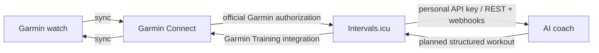
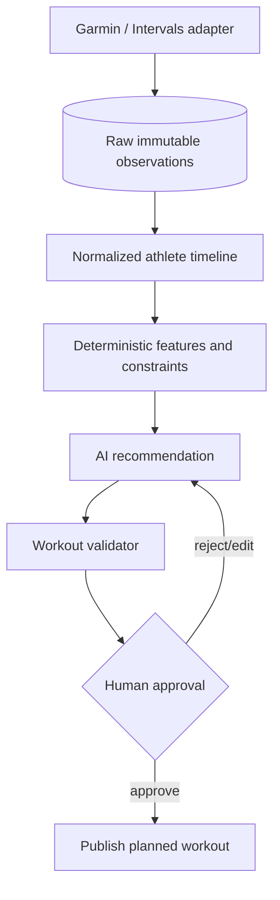

# Garmin access options for an AI coach

**Research date:** 2026-07-16

## Conclusion

A useful end-to-end Garmin AI coach is possible. Literal, unrestricted access to every Garmin Connect account feature is not available through one supported permission.

For a **personal, single-user coach**, the best supported route today is:

This gives the coach the data it normally needs—activities, wellness/recovery data, and the training calendar—and lets it deliver structured workouts to the watch without storing Garmin credentials or using private Garmin endpoints. It is not full Garmin-account administration.

For the **broadest personal experimentation**, `python-garminconnect` can access many more Garmin Connect features and perform writes, but it relies on undocumented/private endpoints. Garmin's current Terms of Use prohibit automated or manual processes that access, copy, or scrape Site content through means not purposely made available through the Site, and permit account suspension or termination for violations. Treat this as a local, disposable prototype with explicit account-risk acceptance—not as a product foundation.[^garmin-terms][^python-garminconnect]

For a **public/commercial product**, apply to the Garmin Connect Developer Program and use the official Health, Activity, Training, and Courses APIs. Garmin describes the program as enterprise/business-only and approval-gated.[^garmin-faq]

## What “full access” separates into

| Capability | Official Garmin program | Intervals.icu bridge | `python-garminconnect` | Local FIT/files |
|---|---:|---:|---:|---:|
| Detailed completed activities | Yes | Yes | Yes | Yes, after file transfer |
| Sleep, HRV, heart rate, stress, wellness | Yes, selected Health API data | Yes, supported wellness fields | Broad private endpoint coverage | Limited/not a cloud wellness feed |
| Training readiness / Garmin-specific computed metrics | Metric-dependent; not every metric is guaranteed | Some fields; connector-dependent | Broad, but endpoint-dependent | Usually unavailable/incomplete |
| Create structured workouts | Yes, Training API | Yes, calendar workout creation then Garmin sync | Yes | Yes, encode a workout FIT file; device transfer is manual/device-specific |
| Schedule workouts on Garmin calendar | Yes | Yes through its Garmin integration | Yes | No cloud calendar |
| Publish courses | Yes, Courses API | Not established in reviewed public docs | Private methods may vary | FIT can encode courses; transfer is manual/device-specific |
| Edit/delete activities and miscellaneous account data | Not established by public API pages | Intervals data, not general Garmin account state | Many such methods exist | No |
| Manage devices, badges, connections, account/security | No general supported surface | No | Some read/private methods, but not literal full administration | No |
| Supported personal hobby access | No published personal tier | Yes | No official support | Yes |
| Garmin credentials handled by coach | No—OAuth 2.0 | No—Garmin connection delegated to Intervals | Initial login/MFA and refresh token | No |
| Stability / terms risk | Lowest | Low-to-medium; third-party dependency | High | Low |

Public Garmin pages describe the intended direction of each API but gate detailed endpoint schemas behind the developer portal. Where the table says a capability is absent or unestablished, that is based on public descriptions, not proof that no gated endpoint exists.[^garmin-portal]

## Option 1 — direct official Garmin APIs

### Capabilities

Garmin's cloud-to-cloud Developer Program exposes:

- **Health API:** JSON summaries for steps, heart rate, sleep, respiration, body composition, stress, pulse ox, Body Battery, blood pressure and other supported metrics after the device syncs to Garmin Connect.[^garmin-health]
- **Activity API:** detailed fitness activity data; the public page advertises activity files in FIT, GPX and TCX and specifically says the API offers FIT-file access.[^garmin-activity]
- **Training API:** publish workouts and training plans to the Garmin Connect calendar for syncing to compatible devices.[^garmin-training]
- **Courses API:** publish courses for device sync.[^garmin-courses]
- **Women's Health API:** menstrual cycle and pregnancy-related data.[^garmin-overview]

The APIs use OAuth 2.0. Garmin's published PKCE specification shows Garmin-hosted login and consent, bearer access tokens, permission inspection, user-permission webhooks, and disconnect/de-registration.[^garmin-oauth]

Data is available after the user syncs the device. Garmin also advertises event-driven notifications delivered within seconds of a sync; this is near-sync, not live sensor streaming.[^garmin-portal]

### Access and cost

- Garmin says the program is for **enterprise/business use**, not a published personal developer tier.[^garmin-faq]
- Access is request/approval-gated. Garmin says it normally reports application status within two business days and a typical integration takes one to four weeks.[^garmin-faq]
- The FAQ says no baseline licensing or maintenance fee, while some metrics/commercial use may require a license fee or minimum device order. No public price schedule was found.[^garmin-faq][^garmin-health]
- A genuine one-user business use may technically be possible, but no public minimum-user rule was found. Approval remains Garmin's decision. A hobby-only app is outside the published business/enterprise positioning. **[Inference]**

### Assessment

Best long-term product architecture and the only route to seek for a commercial coach. It supports the core coaching loop, but not literal full-account control and not guaranteed access to every Garmin-calculated metric.

## Option 2 — Intervals.icu as the supported personal bridge

Intervals.icu already has Garmin authorization and provides a separate, public API suitable for personal automation.

Its public API supports:

- personal API keys and OAuth 2.0;
- activity upload/download in FIT, TCX, GPX, ZIP and GZ;
- push/pull wellness data;
- calendar workout creation and management;
- webhooks and external-ID mapping.[^intervals-api]

Its Garmin integration automatically downloads Garmin activities, syncs wellness data, and can upload planned workouts so they appear after the next Garmin Connect/device sync.[^intervals-garmin-read][^intervals-garmin-write][^intervals-wellness]

### Advantages

- Build immediately without asking Garmin for API keys.
- The AI service never needs the Garmin password, MFA code, or private Garmin session token.
- A personal Intervals API key is explicitly supported.
- Read and write paths cover the normal coaching loop.
- Intervals already supplies useful training-load, calendar, and workout-domain structures.

### Limitations

- Not every Garmin account object or Garmin-specific computed metric is exposed.
- Another service receives health/activity data; its privacy and retention model must be acceptable.
- Connector behavior and supported fields can change.
- It adds a second source of truth unless the architecture declares Garmin as the activity source and Intervals as the coach/calendar projection.

### Assessment

**Recommended personal MVP.** It is the best balance of functionality, speed, security, and stability. It is already the architecture an AI coach needs rather than the broader—and unnecessary—goal of controlling the whole Garmin account.

## Option 3 — unofficial Garmin Connect client

`python-garminconnect` is the broadest practical personal route. Its current README advertises 134+ endpoints and methods for health metrics, historical trends, device information, activities, workout uploads/scheduling, training status, gear, hydration, body composition and more.[^python-garminconnect]

Current authentication uses Garmin mobile-app-style SSO, MFA callbacks, and DI OAuth access/refresh tokens stored at `~/.garminconnect/garmin_tokens.json` with mode `0600`. The implementation includes multiple login strategies, TLS impersonation, randomized/alternate browser identities, anti-WAF delays, and private `connectapi` URLs.[^python-garminconnect-source]

### Evidence of fragility

A June–July 2026 project issue documents new DI tokens being accepted by the token service but rejected by Connect APIs, account/IP `429` responses, and strategy-specific workarounds. The project was actively updated in July 2026, which is a positive maintenance signal but also shows that Garmin changes can break it abruptly.[^python-garminconnect-369]

### Terms and account risk

Garmin's Terms of Use, effective 2026-04-01, prohibit processes—automated or manual—that access, copy, or scrape Site content through means not purposely made available through the Site. Garmin reserves the right to suspend or terminate accounts for violations.[^garmin-terms]

Therefore:

- suitable only for a private prototype if the owner explicitly accepts breakage and account risk;
- do not ship it to users or collect their Garmin credentials;
- keep it local, encrypted, rate-limited, cached, and read-only by default;
- require explicit human approval before any write;
- maintain export/backups and expect re-authentication or total failure.

`garth` should not be selected for new work: its README says it is deprecated, no longer maintained, and new logins no longer work after Garmin's authentication change.[^garth]

GarminDB and the Home Assistant Garmin integration can be useful local consumers, but they inherit the same private authentication/endpoints and do not remove the terms or stability risk.[^garmindb][^ha-garmin]

## Option 4 — local FIT/file pipeline

Garmin's FIT protocol and free SDK support encoding and decoding activity, workout, and course files in C, C++, C#, Java, JavaScript, Objective-C, Python, and Swift.[^fit-sdk]

A local coach can:

1. ingest activity FIT files from manual Garmin export or a connected device;
2. generate deterministic training analysis locally;
3. encode structured workout FIT files;
4. transfer them through a supported manual import/device workflow.

Advantages: no account credentials, low terms risk, full ownership of files, excellent backfill/backup path. Disadvantages: manual/device-specific transfer, no reliable cloud event feed, no complete all-day wellness stream, and no Garmin calendar automation.

Use this as a privacy-first offline mode and data-portability fallback, not the main seamless coach loop.

## Option 5 — mobile health stores and aggregators

### Apple Health / Android Health Connect

Garmin supports exporting selected data to phone health stores through Garmin Connect. A mobile AI-coach app could read the health store after user permission. This is useful for a subset of health/activity data, but it is not complete Garmin-account access and does not provide a documented route for publishing structured Garmin workouts.[^garmin-apple-health][^garmin-health-connect]

### Wearable API aggregators

Commercial aggregators such as Terra offer a normalized Garmin read integration using webhooks/HTTP for activity, daily, sleep, body and related data.[^terra-garmin] This reduces vendor-specific work for a multi-wearable product, but adds vendor cost/dependency and a further health-data processor. A Garmin planned-workout write path was not verified in the reviewed Terra Garmin documentation; do not assume it.

### Strava and TrainingPeaks

- Strava is a sound OAuth activity mirror, not a Garmin wellness or structured-workout bridge. Its API supports reading and writing Strava activities, not publishing Garmin device workouts.[^strava-auth][^strava-garmin]
- TrainingPeaks can sync structured training with Garmin, but its partner API is approved-developer-only and explicitly unavailable for personal use.[^trainingpeaks]

## Option 6 — Connect IQ or Garmin Health SDKs

These are complementary, not Garmin-account APIs.

- **Connect IQ** can put a coach UI/data field/app on a watch, access permitted on-device data, and communicate with web services when connected. It does not grant broad Garmin Connect history or account access.[^connect-iq]
- **Garmin Health SDKs** provide direct mobile-to-watch data and real-time sensor streaming. Garmin describes them as Garmin Health enterprise-partner products; evaluation is free, while commercial use requires a license fee or minimum device order. The Standard SDK can bypass Garmin Connect, while the Companion SDK works alongside it.[^health-sdk]

Use Connect IQ later if watch-side prompts or live workout interaction are valuable. Do not start there for the core data integration.

## Rejected route — browser automation

Browser/Selenium automation can technically reproduce Garmin Connect UI actions, but it is the worst unattended option: credentials/session exposure, MFA/CAPTCHA, layout changes, Cloudflare/WAF behavior, and the same Terms-of-Use problem. Keep manual UI use as a recovery path; do not automate it as architecture.

## Recommended implementation sequence

### Personal project

1. **Connect Garmin to Intervals.icu.** Enable activities, wellness, and planned-workout upload.
2. **Build against the Intervals personal API key.** Ingest activities/wellness/calendar, cache raw responses, normalize into coach-owned records, and consume webhooks where available.
3. **Make writes approval-gated.** The AI proposes a structured workout; deterministic validation enforces duration, intensity, progression, injury/illness flags, and schedule conflicts; the user approves; only then publish to Intervals.
4. **Confirm the closed loop on the real device.** Watch sync → completed activity appears → coach adapts plan → approved workout reaches Garmin calendar/watch.
5. **Add local FIT export/import as backup.** This protects data portability and enables recovery if a connector changes.
6. **Only add an unofficial Garmin sidecar for a specific missing metric.** Prefer read-only, local execution; never make it the only data path.

### Product path

1. Establish the business/legal entity and privacy model.
2. Apply for Garmin Connect Developer Program access for Health, Activity, Training, and any required Courses/Women's Health permissions.
3. Keep an integration adapter so Intervals/aggregators can be replaced by direct Garmin OAuth without changing the coach domain model.
4. Treat Connect IQ or Health SDK as later capabilities, not prerequisites.

## Suggested coach boundary

The model should not receive account credentials or hold arbitrary write access. Give it normalized observations and a narrow `propose_workout` interface; keep authentication, validation, idempotency, retries, and publishing outside the model.

## Sources

[^garmin-overview]: Garmin, [Garmin Connect Developer Program overview](https://developer.garmin.com/gc-developer-program/overview/), accessed 2026-07-16.
[^garmin-faq]: Garmin, [Garmin Connect Developer Program FAQ](https://developer.garmin.com/gc-developer-program/program-faq/), accessed 2026-07-16.
[^garmin-health]: Garmin, [Health API](https://developer.garmin.com/gc-developer-program/health-api/), accessed 2026-07-16.
[^garmin-activity]: Garmin, [Activity API](https://developer.garmin.com/gc-developer-program/activity-api/), accessed 2026-07-16.
[^garmin-training]: Garmin, [Training API](https://developer.garmin.com/gc-developer-program/training-api/), accessed 2026-07-16.
[^garmin-courses]: Garmin, [Courses API](https://developer.garmin.com/gc-developer-program/courses-api/), accessed 2026-07-16.
[^garmin-portal]: Garmin, [Garmin Connect Developer portal](https://developerportal.garmin.com/developer-programs/connect-developer-api), accessed 2026-07-16.
[^garmin-oauth]: Garmin, [OAuth 2.0 PKCE specification](https://developerportal.garmin.com/sites/default/files/OAuth2PKCE_1.pdf), HTTP Last-Modified 2025-07-23, accessed 2026-07-16.
[^garmin-terms]: Garmin, [Terms of Use](https://www.garmin.com/en-US/legal/terms-of-use/), effective 2026-04-01, accessed 2026-07-16.
[^intervals-api]: Intervals.icu, [Open API](https://www.intervals.icu/features/open-api/) and [API docs](https://intervals.icu/api-docs.html), accessed 2026-07-16.
[^intervals-garmin-read]: Intervals.icu, [Garmin Connect sync now supported](https://forum.intervals.icu/t/garmin-connect-sync-now-supported/2353), 2020-12-30.
[^intervals-garmin-write]: Intervals.icu, [Upload planned workouts to Garmin Connect](https://forum.intervals.icu/t/upload-planned-workouts-to-garmin-connect/1521), 2020-08-19.
[^intervals-wellness]: Intervals.icu, [Wellness integration](https://www.intervals.icu/features/wellness/), accessed 2026-07-16.
[^python-garminconnect]: cyberjunky, [python-garminconnect README](https://github.com/cyberjunky/python-garminconnect), accessed 2026-07-16.
[^python-garminconnect-source]: cyberjunky, [python-garminconnect client source](https://github.com/cyberjunky/python-garminconnect/blob/master/garminconnect/client.py), accessed 2026-07-16.
[^python-garminconnect-369]: cyberjunky/python-garminconnect, [Issue #369: OAuth2 token rejected by API](https://github.com/cyberjunky/python-garminconnect/issues/369), 2026.
[^garth]: matin, [garth README](https://github.com/matin/garth), accessed 2026-07-16.
[^garmindb]: tcgoetz, [GarminDB README](https://github.com/tcgoetz/GarminDB), accessed 2026-07-16.
[^ha-garmin]: cyberjunky, [Home Assistant Garmin Connect integration](https://github.com/cyberjunky/home-assistant-garmin_connect) and [ha-garmin](https://github.com/cyberjunky/ha-garmin), accessed 2026-07-16.
[^fit-sdk]: Garmin, [FIT SDK overview](https://developer.garmin.com/fit/overview/) and [Encoding FIT workout files](https://developer.garmin.com/fit/cookbook/encoding-workout-files/), accessed 2026-07-16.
[^garmin-apple-health]: Garmin Support, [Sharing Garmin Connect data with Apple Health](https://support.garmin.com/en-US/?faq=lK5FPB9iPF5PXFkIpFlFPA), accessed 2026-07-16.
[^garmin-health-connect]: Garmin Support, [Sharing Garmin Connect data with Health Connect](https://support.garmin.com/en-US/?faq=JToBEy0jfe6pIygark2Ui5), accessed 2026-07-16.
[^terra-garmin]: Terra, [Garmin API integration](https://tryterra.co/integrations/garmin), accessed 2026-07-16.
[^strava-auth]: Strava, [OAuth authentication](https://developers.strava.com/docs/authentication/) and [uploads](https://developers.strava.com/docs/uploads/), accessed 2026-07-16.
[^strava-garmin]: Strava Support, [Garmin and Strava](https://support.strava.com/en-us/articles/15401903-garmin-and-strava), accessed 2026-07-16.
[^trainingpeaks]: TrainingPeaks, [Partner API update](https://www.trainingpeaks.com/blog/an-update-on-trainingpeaks-partner-api/), accessed 2026-07-16.
[^connect-iq]: Garmin, [Connect IQ overview](https://developer.garmin.com/connect-iq/overview/) and [Communications API](https://developer.garmin.com/connect-iq/api-docs/Toybox/Communications.html), accessed 2026-07-16.
[^health-sdk]: Garmin, [Garmin Health SDK overview](https://developer.garmin.com/health-sdk/overview/), accessed 2026-07-16.
